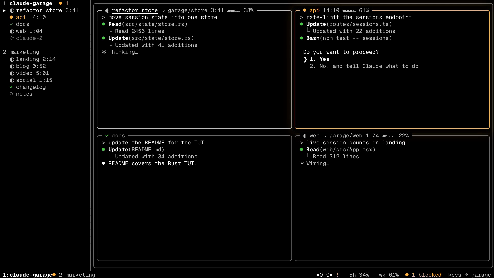

<div align="center">


**Run many Claude Code sessions. See them all in one terminal.**

[](https://www.npmjs.com/package/claude-garage)
[](LICENSE)
[](#privacy)



</div>

https://github.com/user-attachments/assets/5c545e4b-508e-4754-9b7a-df73c589e323

## What it does

- **Shows every session at once.** One full-screen grid per project.
- **Tells you who needs you.** A session waiting for your answer turns
  amber. Press `a` to jump to it, from any project.
- **Keeps sessions alive.** tmux runs them, not garage. Close the
  terminal or reboot, and your sessions come back with their full
  conversation.

It's small: a 2.6 MB binary, about 6 MB of RAM and ~2% CPU.

## Install

You need:

- macOS
- Node.js 20 or newer
- [tmux](https://github.com/tmux/tmux) 3.2 or newer (garage offers to
  install it with `brew`)
- [Claude Code](https://docs.claude.com/en/docs/claude-code) on your `PATH`

Then run:

```bash
npx claude-garage tui
```

On an Intel Mac, the first run builds the app from source, so you also
need Rust ([rustup.rs](https://rustup.rs)). Apple Silicon needs nothing
extra.

## First steps

1. Press `w` and add a project folder. You can type, paste or drag the
   path in, or press `Ctrl+O` to pick a folder.
2. Press `n` to start a Claude session in it.
3. Press `Enter` to type into the session. Press `Ctrl+G` to get back to
   garage.
4. Press `?` any time to see all keys.

Press `q` to quit. Your sessions keep running in the background.

## Session states

| Glyph | State | Meaning |
|---|---|---|
| `●` | needs input | Claude is waiting for your answer. Always sorted first. |
| `◐` | working | Claude is running. |
| `✓` | done | Finished since you last looked. |
| `○` | idle | Waiting for your next request. |
| `⟳` | restorable | The session stopped (after a reboot, say). Press `Enter` to bring it back. |

## Keys

**Moving around**

| Key | Action |
|---|---|
| `1`–`9` | switch project |
| `[` / `]` | previous / next session |
| `Tab` | switch view |
| `m` | maximize the focused session |
| `a` | jump to the session waiting longest |
| `A` | list every waiting session |

**Typing into a session**

| Key | Action |
|---|---|
| `Enter` | start typing into the focused session |
| `Ctrl+G` | stop typing, back to garage |
| `t` | open the session in its own terminal window |

**Sessions and projects**

| Key | Action |
|---|---|
| `n` | new session |
| `N` | new session in its own git worktree |
| `x x` | close the focused session |
| `R` | bring back all stopped sessions in this project |
| `d` | move the session into its own view (press again to move it back) |
| `D` | move the session to another view |
| `w` | add a project |
| `X X` | remove the project (sessions keep running) |
| `X K` | remove the project and close its sessions |

**Restart and extras**

| Key | Action |
|---|---|
| `r r` | restart the focused session on the latest `claude` |
| `r a` | restart all idle sessions in this project |
| `r d` | restart garage's background service |
| `I` | install the context meter (shows how full each session's context is) |
| `P` | pick a pit pet |
| `?` | show all keys |
| `q` | quit |

> **Terminal tip:** Ghostty, iTerm2, kitty and WezTerm work best. In
> macOS Terminal.app, `Shift+Enter` acts like `Enter`. Use `Option+Enter`
> for a new line instead.

## Restarting

When Claude Code ships an update, running sessions keep the old version.
To update them:

```bash
claude-garage restart --sessions
```

This restarts every idle session and keeps its conversation. Busy
sessions are skipped. Add `--all` to restart those too.

`claude-garage restart` alone restarts only garage's background service.
Your sessions are not touched.

## Pit pet

An optional pet lives in the bottom bar. It sleeps when all is quiet and
runs to alert you when a session needs you. Press `P` to choose one.

<div align="center">


<b>Arthur</b> &nbsp;&nbsp;&nbsp;&nbsp;&nbsp;&nbsp;&nbsp; <b>Papito</b> &nbsp;&nbsp;&nbsp;&nbsp;&nbsp;&nbsp;&nbsp; <b>Segan</b>
</div>

## Privacy

Everything stays on your machine.

- garage listens on `127.0.0.1` only.
- No telemetry, no accounts.
- State is one file: `~/.garage/state.json`.

## How it works

```
tmux            runs every session
  └─ daemon     small Node service: starts, lists and watches sessions
       └─ TUI   the Rust terminal wall you look at
```

You can delete garage and your sessions keep running. Reattach any of them
with `tmux attach -t garage/<project>/<label>`.

## Development

```bash
npm install
npm test             # daemon tests
npm run build:tui    # build the Rust app into wall/dist
cd wall && cargo test --lib --bins
```

Note: plain `cargo test` also starts and kills real tmux sessions.

## Roadmap

- Linux support
- Diff review in the TUI
- Adopt an existing tmux session
- Phone notifications

## License

[MIT](LICENSE) © Saiful Islam

*Not affiliated with Anthropic. "Claude" and "Claude Code" are Anthropic
trademarks.*
