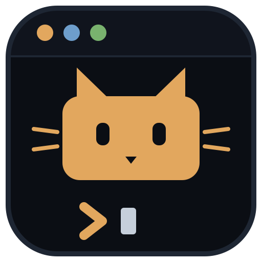
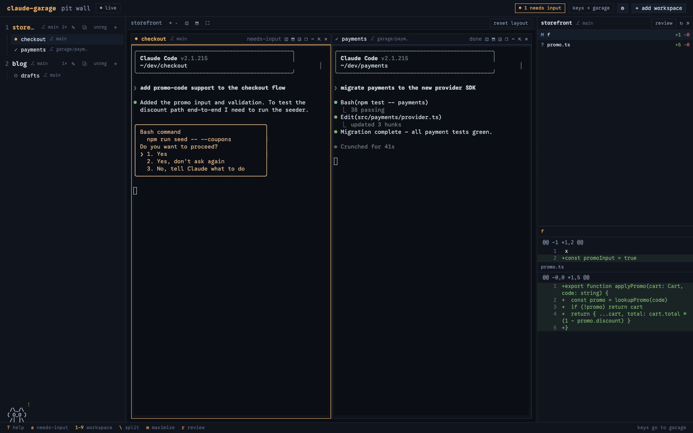

<div align="center">



# claude-garage

**A pit wall for your Claude Code agents.**

Run many Claude Code sessions across many projects — live, side by side —
and know the instant one needs you.

[](https://www.npmjs.com/package/claude-garage)
[](LICENSE)
[](package.json)
[](#local-only-by-design)



</div>

## Why

Running multiple Claude Code sessions across multiple projects means juggling
terminal windows and editor windows. There is no single place to see:

- **which sessions exist**, per project
- **which one is blocked waiting for your input** — the real pain isn't window
  count, it's attention routing
- **what each session changed**, reviewable without hunting

claude-garage is that single place: one screen, built around four things that
rarely coexist —

1. 🔌 **Real terminals that survive the tool.** tmux owns every session, not
   the app. Close the tab, kill the daemon, reboot the Mac —
   `tmux attach -t garage/<workspace>/<label>` still works, and dead sessions
   restore with their full conversation (`claude --resume`) in one click.
2. 🖥️ **Every session of a project on screen at once.** Not a switcher — a
   live grid of interactive terminals. Split, resize, maximize, float, or
   detach into standalone views, VS Code-style.
3. 🚨 **Needs-input triage as a first-class queue.** Blocked sessions sort
   first everywhere, light up amber, count into the header badge and the tab
   title; `a` jumps to whichever agent is waiting, across every project.
   Notifications reach you even when the wall isn't visible.
4. 📋 **File-by-file diff review with an editor jump.** Per-workspace or
   per-worktree changes (committed and uncommitted), a full-screen review mode
   with viewed-tracking, and `o` to open your editor at the exact line.

## Quick start

```bash
npx claude-garage
```

Opens the pit wall at `http://127.0.0.1:4747`. Add a workspace, spawn
sessions with the `+` next to its name, and press `?` for the keys.

**Requirements:** macOS · [tmux](https://github.com/tmux/tmux) ≥ 3.2 ·
[Claude Code](https://docs.claude.com/en/docs/claude-code) CLI · Node ≥ 20

**Hooks (recommended):** status updates poll every 2s by default. Click
**install hooks for me** in the banner for instant detection — the daemon
merges Claude Code's hooks into `~/.claude/settings.json` (backup kept,
idempotent).

## Local-only by design

Everything runs on your machine and stays there.

- The daemon binds to `127.0.0.1` only — nothing listens on your network.
- **No telemetry, no analytics, no accounts.** garage collects nothing and
  phones home to no one.
- All state is a single local file (`~/.garage/state.json`) plus your own
  tmux server and git repos.
- Your sessions talk to Claude exactly as they would without garage — the
  wall is a viewer, not a middleman.

## Session states

| Glyph | State | Meaning |
|---|---|---|
| `●` | **needs-input** | Claude is waiting on *you* — permission, question, plan approval. Never fades; sorts first everywhere. |
| `◐` | working | Claude is running. |
| `✓` | done | Finished a turn since you last looked (fades after 2 min). |
| `○` | idle | Waiting for you to *ask*, not to *answer*. |
| `⟳` | restorable | tmux died (reboot?) — one click resurrects the conversation. |

## Also on the wall

- 🌳 **Worktree sessions** — spawn in an isolated git worktree on a
  `garage/<label>` branch; on close: **merge / discard / keep**.
- 🎨 **Themes** — garage, claude dark, claude light, or follow the OS;
  terminals re-skin in place, full ANSI palettes included.
- 🐈 **A pit pet** (opt-in) — an ASCII shop cat / rubber duck / pit pup whose
  mood mirrors the wall; it runs toward the rail when an agent needs you.
- 🔔 **Notifications** — badge + tab title in-app, opt-in browser
  notifications (click → jump) when the tab is hidden, macOS notification
  when no page is open (clickable with
  [`terminal-notifier`](https://github.com/julienXX/terminal-notifier)).

## Keybindings

| Key | Action |
|---|---|
| `1`–`9` | switch focused workspace |
| `[` / `]` | cycle terminals within the workspace |
| `a` | jump to a session that needs input, anywhere |
| `\` | split the focused cell (new session beside it) |
| `m` | maximize the focused cell ⇄ restore |
| `Tab` / `j` / `k` | changes pane: emphasis / next / prev file |
| `r` | full-screen review mode · `v` mark viewed · `o` open in editor |
| `Ctrl+\`` | release keys from the terminal back to garage |
| `?` | keybindings + status legend |

Bindings pause while a terminal has keyboard focus — the header chip always
shows where your keys go.

## How it works

```
tmux  (persistence — source of truth)
  └─ small Node daemon  (spawn / list / bridge / diff / hooks)
       └─ browser UI  (React + xterm.js)
```

The daemon is a thin Fastify process that shells out to `tmux`/`git`/`claude`
rather than re-implementing them; diffs are computed read-only; hook events
are token-authed. The UI is a viewer over SSE + WebSockets. tmux is the
registry — garage can be deleted and your sessions won't notice.

## Development

```bash
npm install
npm run dev     # daemon :4747 + Vite :5173
npm test        # node:test — status, poller, hooks, layout, views
```

Built through spec-driven phases ([`openspec/`](openspec/)), each verified
end-to-end on a real system.

## Roadmap

`claude-garage attach` (adopt an existing tmux session) · phone push
(ntfy/webhook) · view renaming & drag · Linux support

## License

[MIT](LICENSE) © Saiful Islam

*claude-garage is a community project, not affiliated with or endorsed by
Anthropic. "Claude" and "Claude Code" are Anthropic trademarks.*
