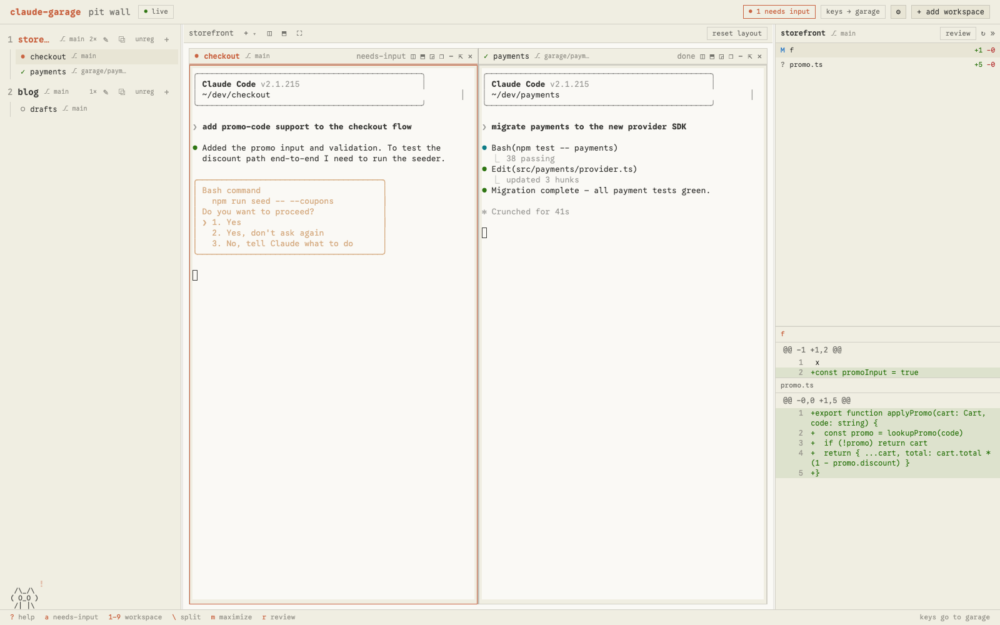

<div align="center">


# claude-garage

**A pit wall for your Claude Code agents.**

Run many Claude Code sessions across many projects — live, side by side —
and know the instant one needs you. tmux owns every session:
close the app and nothing dies.

[](https://www.npmjs.com/package/claude-garage)
[](LICENSE)
[](package.json)
[](#requirements)


</div>

## Why

Running one Claude Code session is easy. Running six across three repos is a
tab-juggling mess — you find out an agent has been **blocked on a permission
prompt for 20 minutes** only when you happen to click its tab.

claude-garage puts every session on one wall:

- 🚨 **Needs-input triage** — the product's core. Blocked sessions sort first
  everywhere, light up amber, count into the header badge and the browser tab
  title, and `a` jumps straight to whichever agent is waiting on you.
- 🖥️ **A real terminal grid** — every session in the focused workspace is a
  live, interactive terminal (xterm.js ⇄ tmux), all streaming at once.
  Split, resize, maximize, float, or detach any of them — VS Code-style.
- 🌳 **Worktree isolation** — spawn a session in its own git worktree on a
  `garage/<label>` branch. When you close it: **merge / discard / keep**.
  The diff pane shows everything the branch would bring, committed or not.
- 📋 **Diff review** — per-workspace (or per-worktree) changes with a
  full-screen review mode: `j`/`k` files, `v` marks viewed, `o` opens your
  editor at the right line.
- 🔌 **tmux owns everything** — garage is a viewer, not a warden. Kill the
  app, reboot the Mac: `tmux attach -t garage/<workspace>/<label>` still
  works, and dead sessions restore with their full conversation
  (`claude --resume`) in one click.
- 🐈 **A pit pet, if you want one** — an ASCII shop cat (or rubber duck, or
  pit pup) that sleeps when all is quiet, watches while agents work, and runs
  toward the rail when one needs you. Off by default.

## Quick start

```bash
npx claude-garage
```

Opens the pit wall at `http://127.0.0.1:4747`. Then click
**＋ add workspace**, point it at a project, and spawn sessions with the `+`
next to the workspace name.

### Requirements

- macOS (Linux: tmux core works, folder picker & notifications degrade — untested)
- [tmux](https://github.com/tmux/tmux) ≥ 3.2 — `brew install tmux`
- [Claude Code](https://docs.claude.com/en/docs/claude-code) CLI on `PATH`
- Node.js ≥ 20

### Hooks (recommended, one click)

Garage detects agent state by polling `claude agents --json` every 2s. For
**instant** detection, click **install hooks for me** in the banner — the
daemon merges Claude Code's Notification/Stop hooks into
`~/.claude/settings.json` (timestamped backup, idempotent). Prefer manual?
`GET /api/hooks/snippet` returns the JSON to merge yourself.

## Session states

| Glyph | State | Meaning |
|---|---|---|
| `●` | **needs-input** | Claude is blocked waiting on *you* — permission, question, plan approval. Never decays; sorts first everywhere. |
| `◐` | working | Claude is running. Leave it alone. |
| `✓` | done | Finished a turn since you last looked (auto-fades after 2 min). |
| `○` | idle | Waiting for you to *ask*, not to *answer*. |
| `⟳` | restorable | tmux died (reboot?) — one click resurrects the conversation. |

## The grid

The default layout is a balanced grid (4 sessions → 2×2). Then shape it:

- **Split** — `◫`/`⬒` on any cell (or `\`) spawns a new session beside it
- **Maximize** — `⛶` or `m` toggles the focused cell full-bleed
- **Float** — `❐` lifts a cell into a draggable window above the grid
- **Standalone views** — `◲` detaches a session into its own view: the rail
  and a view strip switch the center column between arrangements, and `a`
  still jumps across views to anything blocked
- **Pop out** — `⇱` moves a terminal to a separate browser window
- Drag tabs to re-dock; everything persists per workspace

## Themes

Settings (⚙) → theme: **garage** (default), **claude dark**, **claude
light**, or **system**. Terminals re-skin in place — including a full ANSI
palette per theme, so diffs stop screaming. Chrome and terminals render in
[Google Sans Code](https://fonts.google.com/specimen/Google+Sans+Code) (bundled, OFL).

<div align="center">

</div>

## Keybindings

| Key | Action |
|---|---|
| `1`–`9` | switch focused workspace to the Nth in rail order |
| `[` / `]` | cycle the focused terminal within the current workspace |
| `a` | jump to a session that needs input, in any workspace or view |
| `\` | split the focused cell right (spawns a new session there) |
| `m` | maximize the focused cell ⇄ restore the grid |
| `Tab` | changes pane: toggle list ⇄ diff |
| `j` / `k` | next / previous changed file |
| `r` | enter full-screen review mode (or the **review** button) |
| `v` | (review mode) mark file viewed, advance to next unviewed |
| `o` | open the selected file — or the workspace root — in your editor |
| `Ctrl+\`` | release keys from the focused terminal back to garage |
| `?` | keybindings + status legend overlay |

All bindings except `Ctrl+\`` are suppressed while a terminal has keyboard
focus — the header chip always shows where your keys go.

## Notifications

- **In the app**: header badge, tab-title count, and (optionally) the pet.
- **Tab hidden**: opt-in browser notifications — click one to jump to the session.
- **No page open**: macOS notification; install
  [`terminal-notifier`](https://github.com/julienXX/terminal-notifier)
  (`brew install terminal-notifier`) to make it clickable → opens the wall.

## How it works

tmux is the source of truth; garage is a thin, near-stateless viewer.

```
tmux  (persistence — source of truth)
  └─ small Node daemon  (spawn / list / bridge / diff / hooks)
       └─ browser UI  (React + xterm.js)
```

- **tmux** owns the processes. Sessions are `garage/<workspace>/<label>`;
  `tmux ls` is the list API. Killing the UI or daemon never touches tmux.
- **Daemon** — thin Fastify, binds `127.0.0.1` only. Shells out to
  `tmux`/`git`/`claude`, bridges terminals over WebSockets, computes diffs
  read-only, receives hook events (token-authed). One small state file:
  `~/.garage/state.json`.
- **UI** — React + xterm.js over HTTP + WebSocket + SSE.
- **Escape hatches everywhere**: `tmux attach` from any terminal, `o` into
  your editor, plain git in `~/.garage/worktrees/…`.

## Development

```bash
npm install
npm run dev     # daemon :4747 + Vite :5173
npm test        # node:test — status store, poller mapping, hooks, layout math, views
```

Built through spec-driven phases (see [`openspec/`](openspec/)) — every
phase ends with a real-system e2e verification.

## Roadmap

- `claude-garage attach` — adopt an existing tmux session onto the wall
- Phone push (ntfy/webhook) when you're away from the machine
- View renaming & drag-between-views
- Linux support

## License

[MIT](LICENSE) © Saiful Islam

*claude-garage is a community project, not affiliated with or endorsed by
Anthropic. "Claude" and "Claude Code" are Anthropic trademarks.*
