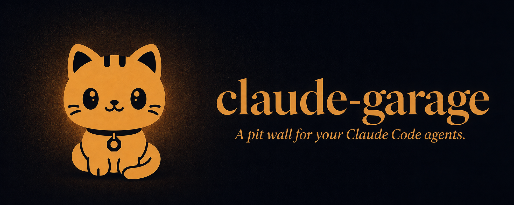
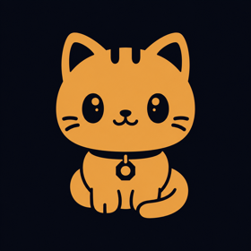
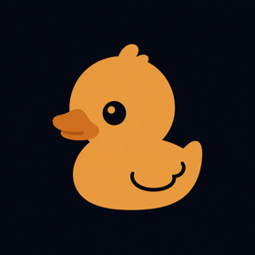
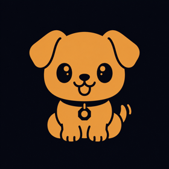

<div align="center">



**Multiple Claude agents driving you crazy? Park them all in one
garage.** A needs-input queue that follows you across every project (`a`
jumps to whoever's waiting), file-by-file diff review, and tmux-owned
sessions that outlive the tool — reboot the Mac, `tmux attach` still works.

[](https://www.npmjs.com/package/claude-garage)
[](LICENSE)
[](package.json)
[](#local-only-by-design)


</div>

**▶ 60-second reveal** — the web wall, needs-input triage, diff review, and the pit pet, beat by beat:

https://github.com/user-attachments/assets/b19defa0-a60d-4082-9ca5-9b8ce9480b18

## Why

Running multiple Claude Code sessions across multiple projects means juggling
terminal windows and editor windows. There is no single place to see:

- **which one is blocked waiting for your input** — right now, anywhere.
  The real pain isn't window count, it's attention routing.
- **what each session changed**, reviewable without hunting
- **which sessions exist**, per project, without them dying the moment you
  close a terminal or reboot

claude-garage is that single place: the garage your agents are parked in,
built around four things that rarely coexist.

1. 🚨 **Needs-input triage as a first-class queue.** Blocked sessions sort
   first everywhere, light up amber, and count into the header badge, the
   tab title, and the TUI's status strip; `a` jumps to whichever agent is
   waiting, across every project, on either surface.
2. 🔌 **Real terminals that survive the tool.** tmux owns every session, not
   the app. Close the terminal, kill the daemon, reboot the Mac:
   `tmux attach -t garage/<workspace>/<label>` still works, dead sessions
   restore with their full conversation (`claude --resume`) in one keypress,
   and `t` pops a live session into its own OS terminal window alongside
   the wall.
3. 📋 **File-by-file diff review with an editor jump — in the web wall.**
   Per-workspace or per-worktree changes (committed and uncommitted), a
   full-screen review mode with viewed-tracking, and `o` to open your editor
   at the exact line. (The TUI doesn't have review mode yet — it's on the
   [Roadmap](#roadmap).)
4. 🖥️ **Every session of a project visible at once.** Not a switcher: the
   web wall renders every session in a workspace as a live terminal
   simultaneously (split/resize/maximize/detach); the TUI groups sessions
   into named views (`d`/`D`/`Tab`) with a 6-tile grid and an overflow rail
   for the rest.

## Quick start

```bash
npx claude-garage tui
```

A full-screen terminal wall, right in your terminal. Starts the daemon if
one isn't already running; `1`–`9` switch workspaces, `Enter` engages the
focused terminal (keys go to the agent byte-exact — Alt+arrows, paste,
everything), `Ctrl+G` hands keys back to the garage, `a` jumps to whoever's
waited longest, `?` for the full keymap. Quitting the TUI leaves the daemon
and every tmux session running. It's also light: ~5ms input latency, ~2%
CPU, and a 2.4MB binary (measured on the ratatui port — see
[`openspec/changes/archive/2026-08-31-p9-ratatui-port/verification.md`](openspec/changes/archive/2026-08-31-p9-ratatui-port/verification.md)).

Since p10–p12, the TUI also groups sessions into views (`d` detaches the
focused one into its own view or rejoins it to the default, `D` moves it to
a chosen group, `Tab` cycles views), shows a dim auto-subtitle under each
session's label straight from Claude Code's own terminal-title updates (zero
config), and tracks context pressure: a per-tile meter plus a `5h`/`7-day`
usage chip in the strip, fed by a one-keypress `I` install of a chaining
statusline wrapper (any statusline you already have keeps running). Closing
a plain session tears it down; closing a worktree session keeps its branch
and points you at the web wall to merge or discard it.

**Prefer a browser?**

```bash
npx claude-garage
```

Opens the web wall at `http://127.0.0.1:4747` — the companion surface, with
diff review and the worktree finish flow (see [Web wall](#web-wall)). Both
commands start the same daemon and see the same tmux sessions, so you can
run either one, or both, at once.

**Requirements**

- macOS (Linux support is on the [Roadmap](#roadmap))
- Node.js ≥ 20
- [tmux](https://github.com/tmux/tmux) ≥ 3.2 (garage offers to `brew install` it if missing)
- [Claude Code](https://docs.claude.com/en/docs/claude-code) CLI on `PATH`
- Rust — **not required on Apple Silicon.** The TUI ships as a prebuilt
  `arm64` binary in the npm package. On an Intel Mac, `claude-garage tui`
  builds it once from source the first time you run it if `cargo` is on
  `PATH` ([rustup.rs](https://rustup.rs)); without `cargo` you get an
  actionable error naming exactly what's missing, not a crash. The web wall
  never needs Rust.

**Hooks (recommended):** status updates poll every 2s by default. Click
**install hooks for me** in the web wall's banner (or press `I` in the TUI
for the statusline half of the story) for instant detection. The daemon
merges Claude Code's hooks/statusline into `~/.claude/settings.json` (backup
kept, idempotent).

## Local-only by design

Everything runs on your machine and stays there.

- The daemon binds to `127.0.0.1` only. Nothing listens on your network.
- **No telemetry, no analytics, no accounts.** garage collects nothing and
  phones home to no one.
- All state is a single local file (`~/.garage/state.json`) plus your own
  tmux server and git repos.
- Your sessions talk to Claude exactly as they would without garage. Both
  the TUI and the web wall are viewers, not a middleman.

## Session states

| Glyph | State | Meaning |
|---|---|---|
| `●` | **needs-input** | Claude is waiting on *you*: permission, question, plan approval. Never fades; sorts first everywhere. |
| `◐` | working | Claude is running. |
| `✓` | done | Finished a turn since you last looked (fades after 2 min). |
| `○` | idle | Waiting for you to *ask*, not to *answer*. |
| `⟳` | restorable | tmux died (reboot?). One keypress/click resurrects the conversation. |

## Web wall

The browser companion (`npx claude-garage`, `http://127.0.0.1:4747`) carries
the features the TUI doesn't have yet:

- 🎨 **Diff review**: the changes pane and full-screen review mode described
  in [Why](#why) — `Tab`/`j`/`k`/`r`/`v`/`o`, see [Keybindings](#keybindings).
- 🌳 **Worktree finish flow**: spawn a worktree session from either surface
  (`N` in the TUI, the worktree toggle here), but **merge / discard / keep**
  on close is web-only for now — the TUI always keeps the branch and tells
  you to finish it here.
- 🎨 **Themes**: garage, claude dark, claude light, or follow the OS.
  Terminals re-skin in place, full ANSI palettes included.
- 🔔 **Notifications**: badge + tab title in-app, opt-in browser
  notifications (click to jump) when the tab is hidden, and a macOS
  notification when no page is open (clickable with
  [`terminal-notifier`](https://github.com/julienXX/terminal-notifier)).

### The pit pet 🐈 (web wall)

An optional ASCII companion on the key strip whose mood *is* the wall:
asleep when all is quiet, watching while agents run, **sprinting toward the
rail with a `!`** the moment a session needs you (click it, that's the `a`
jump), hiding in a box if the daemon drops, and celebrating when the last
blocked session is answered. **Clicking it when nothing is wrong pets it.**
It appreciates this.

<div align="center">




<b>Arthur</b> &nbsp;&nbsp;&nbsp;&nbsp;&nbsp;&nbsp;&nbsp;&nbsp; <b>Papito</b> &nbsp;&nbsp;&nbsp;&nbsp;&nbsp;&nbsp;&nbsp;&nbsp; <b>Segan</b>
</div>

Turn it on (or off again) anytime in ⚙ settings under *pit pet*. It's
**off by default**: nobody gets a surprise Papito. Each species plays its
state in character:

| Pet | Personality |
|---|---|
| **Arthur** (shop cat) | saunters, barely deigns to bounce, ignores about 40% of your strolls, and celebrates by kneading in place. Cats don't jump for joy in front of you |
| **Papito** (rubber duck) | deadpan: waddles, **never** bounces, and alerts with a single motionless stare; celebration is exactly one flap |
| **Segan** (pit pup) | maximum enthusiasm: fastest runner, biggest bounce, and celebrates with zoomies across the strip |

## Keybindings

The TUI's full keymap (`claude-garage tui`, also shown in-app with `?`).
Bindings apply at the garage layer; `Enter` hands your keystrokes to the
focused session byte-exact until `Ctrl+G` takes them back.

| Key | Action |
|---|---|
| `1`–`9` | focus workspace |
| `[` / `]` | cycle focused tile |
| `Enter` | engage focused tile (restore it when restorable) |
| `Ctrl+G` | disengage (while engaged) |
| `m` | maximize / restore focused tile |
| `t` | open focused session in a new terminal window (macOS) |
| `a` | jump to longest-waiting blocked session |
| `A` | triage queue |
| `n` / `N` | spawn session / worktree session |
| `R` | restore all restorable sessions in workspace |
| `I` | install statusline feed for context meters |
| `x x` | close focused session (press twice) |
| `X X` | remove focused workspace (sessions keep running) |
| `X K` | remove focused workspace AND kill its sessions |
| `w` | add workspace |
| `d` | detach focused session to its own view, or rejoin main |
| `D` | move focused session to another view / new group |
| `Tab` | cycle the focused workspace's views |
| `?` | toggle this help |
| `q` | quit (tmux sessions keep running) |

The web wall has its own compact keymap for its own features (grid
navigation plus diff review) — press `?` there for the full list:
`1`–`9` workspace, `[`/`]` cycle terminal, `a` jump, `\` split cell, `m`
maximize, `Tab`/`j`/`k`/`r`/`v`/`o` for the changes pane and review mode,
`` Ctrl+` `` releases keys back to the browser wall.

## How it works

```
tmux  (persistence, source of truth)
  └─ small Node daemon  (spawn / list / bridge / diff / hooks / statusline)
       ├─ Rust terminal wall   (ratatui + crossterm — `claude-garage tui`)
       └─ browser web wall     (React + xterm.js — `npx claude-garage`)
```

The daemon is a thin Fastify process that shells out to `tmux`/`git`/`claude`
rather than re-implementing them; diffs are computed read-only; hook and
statusline events are token-authed. Both UIs are viewers over the same
daemon: the web wall over SSE + WebSockets, the TUI over HTTP/SSE for state
and direct `tmux attach` PTYs for the terminals themselves — no WebSocket
terminal bridge in the TUI path. tmux is the registry: garage can be deleted
and your sessions won't notice.

## Development

```bash
npm install
npm run dev          # daemon :4747 + Vite :5173 (web wall)
npm test             # node:test suite (status, poller, hooks, layout, views)
npm run build:tui    # cargo build --release; copies the binary into wall/dist
```

`wall/` is a separate Rust workspace with its own unit and e2e suites
(`cd wall && cargo test`; e2e harnesses under `wall/test/e2e`).

Built through spec-driven phases ([`openspec/`](openspec/)), each verified
end-to-end on a real system.

## Roadmap

- `claude-garage attach`: adopt an existing tmux session onto the wall
- Review mode in the TUI (the web wall's file-by-file diff review, ported)
- Linux support
- Phone push (ntfy/webhook) for when you're away from the machine
- View renaming

## License

[MIT](LICENSE) © Saiful Islam

*claude-garage is a community project, not affiliated with or endorsed by
Anthropic. "Claude" and "Claude Code" are Anthropic trademarks.*
